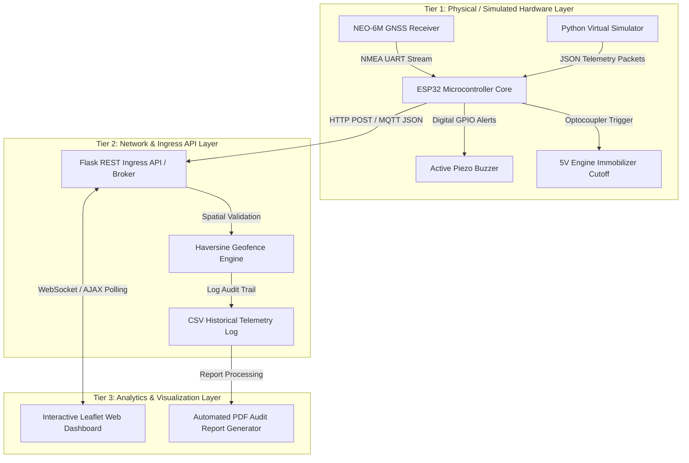

# 🏛️ Technical System Architecture

The **IoT Vehicle Tracking & Theft Prevention System** is engineered as a modular, 3-tier distributed IoT architecture combining low-level embedded hardware sensors with cloud processing engines and interactive user dashboards.

---

## 🏗️ 3-Tier Architecture Diagram

---

## 📐 Mathematical Containment Algorithm: Spherical Haversine

When monitoring vehicles, evaluating whether a coordinate $( \phi_2, \lambda_2 )$ falls within a circle of radius $R_{\text{safe}}$ centered at $( \phi_1, \lambda_1 )$ requires computing shortest paths across the Earth's curvature.

The exact algorithmic sequence implemented in both `arduino_code/vehicle_tracker_esp32.ino` and `python_simulation/geofence_engine.py` is:

1. Convert coordinates from decimal degrees to radians:
   $$\phi_1 = \text{deg2rad}(\text{lat}_1), \quad \phi_2 = \text{deg2rad}(\text{lat}_2)$$
2. Compute coordinate delta:
   $$\Delta\phi = \phi_2 - \phi_1, \quad \Delta\lambda = \lambda_2 - \lambda_1$$
3. Evaluate great-circle chord length:
   $$a = \sin^2\left(\frac{\Delta\phi}{2}\right) + \cos(\phi_1)\cos(\phi_2)\sin^2\left(\frac{\Delta\lambda}{2}\right)$$
4. Compute angular distance $\theta$:
   $$c = 2 \cdot \text{atan2}\left(\sqrt{a}, \sqrt{1-a}\right)$$
5. Evaluate against radius threshold:
   $$d = R_{\text{Earth}} \cdot c \implies \text{If } d > R_{\text{safe}}, \text{ assert } \texttt{GEOFENCE\_BREACH}$$
